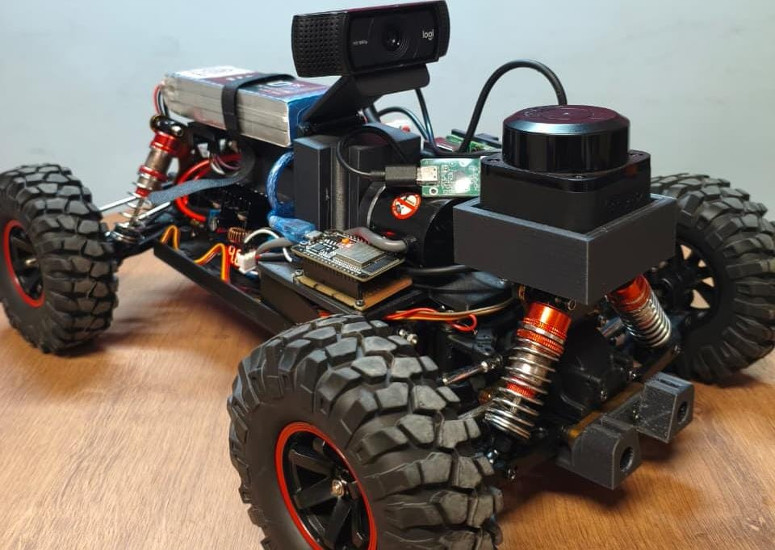

# Development of a 1:10 Autonomous Vehicle: Visual Localization Stage

The main goal in this work is to assemble technologies such as computer vision, LiDAR, IMU, and ROS 2 to develop a cost-effective autonomous vehicle capable of self-perceiving and mapping its environment, aiming to enhance the hardware and software, and to share knowledge through this repository and future articles.
## Materials
The following components were used:
WLtoys 104001 RC car, brushed 550 motor, 20kgf servo motor, Raspberry Pi 5 16GB, encoder, ESP32, Logitech Webcam C920e, H-Bridge BTS7960, step-down module, LiPo battery 11.1V, RPLiDAR C1, BNO055 DFRobot, PLA + carbon fiber PLA (PLA-CF) for supports, XT60 connectors, etc.
## Repository Structure
- `/ros2_ws` — ROS 2 workspace
- `/firmware` — ESP32 code
- `/docs/images` — Project images
## Software Requirements
The main technologies below are necessary for coding, assembly, and control:
+ Linux Ubuntu 24.04 ARM64
+ ROS 2 Jazzy Jalisco and its tools
+ Arduino IDE
+ OpenCV
## Setup
1. Clone this repository
2. Follow ROS 2 Jazzy Jalisco documentation to install it
3. Upload the ESP32 code with Arduino IDE
4. `cd ros2_ws`
5. `source /opt/ros/jazzy/setup.bash`
6. `source install/setup.bash`
7. `colcon build`
## Current Stage
The project is currently focused on visual localization, using SLAM Toolbox and robot_localization.
Next steps: sensor fusion with IMU, LiDAR, ArUco markers, and classic odometry.
## Notes
> This project is under active development. Please check the most recent branch for the latest updates.
> To reproduce this work, familiarity with the theoretical background is highly recommended, as not every command and package is listed here.
